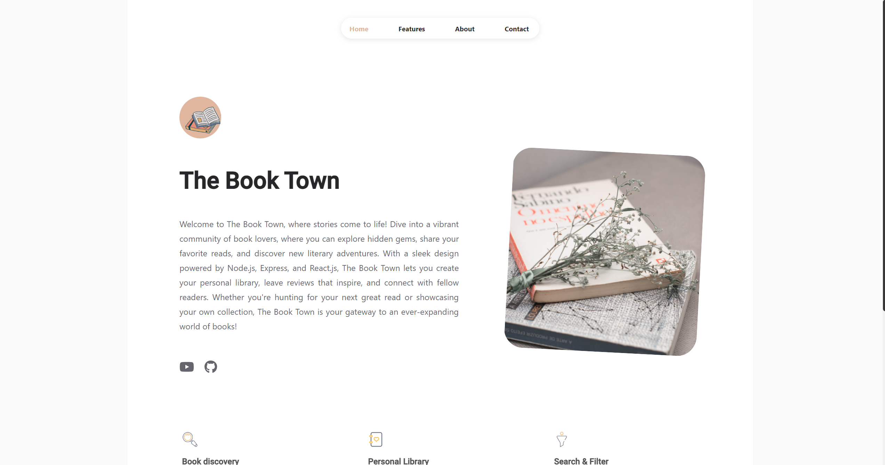

# The Book Town Potfolio V1.0 📖

BookTown Portfolio is a modern portfolio web app built using the popular React library. This web application provides users with a brief description of the project features. Book Town integrates modern web development practices and serves as a demonstration of my expertise in frontend development, state management, and UI design.

<center>

</center>

Live demo here: <a href="https://booktown-portfolio.vercel.app/" target="_blank">LIVE DEMO</a>


-   [Features](#-features)
-   [Getting started](#-getting-started)
-   [Installation and Setup Instructions](#-installation-and-setup-instructions)
-   [Google Analytics](#-google-analytics)
-   [Building the React App](#-building-the-react-app)
-   [Contribution](#-contribution)

## 📙 Features

-   📖 Multi-Page Layout
    -   Home
    -   Features
    -   About
    -   Contact

## 📚 Getting started

Clone down this repository. You will need `NodeJS` and `git` installed globally on your machine.

## 🛠 Installation and Setup Instructions

1. Installation: `npm install`

2. Run the project: `npm start`

Runs the app in the development mode.\
Open [http://localhost:3000](http://localhost:3000) to view it in the browser.
The page will reload if you make edits.

## 📈 Google Analytics

Add your Google Analytics 4 MEASUREMENT ID to `/src/data/tracking.js`.

How to find the Google Analytics 4 MEASUREMENT ID ?

[https://support.google.com/analytics/answer/9539598?hl=en](https://support.google.com/analytics/answer/9539598?hl=en)

## 🚀 Building the React App

To build the React app, you can use the `npm run build` command. This will create a production-ready build of your app in the `build/` directory.

Here are the steps to follow:

1. Open a terminal window and navigate to the root directory of your React app.
2. Run the `npm run build` command to create a production build of your app. This will generate a static bundle of your app in the `build/` directory.
3. Copy the contents of the `build/` directory to your server's public directory. You can do this using an FTP client or by running a command like `scp` to transfer the files to your server. Make sure to replace `example.com` and `/var/www/html` with your server's domain name and public directory, respectively:

    ```bash
    scp -r build/* user@example.com:/var/www/html
    ```

4. Your portfolio app should now be accessible from your server's domain name. You can verify this by opening a web browser and navigating to http://example.com (replace example.com with your server's domain name).

That's it! Your React portfolio app should now be up and running on your server. Note that you may need to configure your server's web server (e.g., Apache or Nginx) to serve the index.html file in the build/ directory as the default page for your domain.


## 🌱 Contribution

If you have any suggestions on what to improve in Reactfolio and would like to share them, feel free to leave an issue or fork project to implement your own ideas
